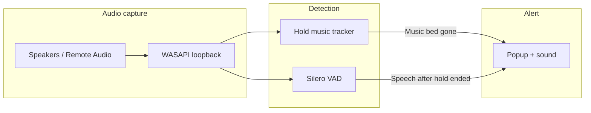

# Hold Assist

**Know when hold music ends and a real person is on the line.**

Hold Assist is a small Windows app that listens to **what your PC is playing** (phone calls, Teams, softphones—not your microphone) and alerts you when hold music stops or someone starts speaking. Built for long hold times on **Windows 10/11**, including **Windows 365** and **Remote Desktop** sessions.

<p align="center">
  
</p>

---

## Why I built this

A client asked whether we could add **“notify when hold ends”** to their telephone app. I reached out to their **phone vendor** and learned they **do not support third-party extensions** and **do not offer this feature** themselves.

Rather than leave it at “not possible,” I spent a little time to see if we could still make it happen on Windows. **This is what I came up with:** a **quick-and-dirty** sidecar utility—not part of the phone system, but it **works**. It runs **fully on your PC**, **fully local** (no cloud, no upload of call audio), and is meant to be **as simple and secure as practical** for a tool of this kind.

If you try it, I’m **open to suggestions** for features and improvements—open an [issue](https://github.com/RetroCodeRamen/Hold-Assist/issues) or contribute via pull request.

---

## Table of contents

- [Download](#download)
- [Privacy and security](#privacy-and-security)
- [Quick start (install)](#quick-start-install)
- [How it works](#how-it-works)
- [Features](#features)
- [Using the app](#using-the-app)
- [Windows 365 / cloud PC tips](#windows-365--cloud-pc-tips)
- [Settings reference](#settings-reference)
- [For developers](#for-developers)
- [Build the installer](#build-the-installer)
- [Publish on GitHub](#publish-on-github)
- [Project structure](#project-structure)
- [Troubleshooting](#troubleshooting)
- [Tech stack](#tech-stack)
- [License](#license)

---

## Download

| What you need | Where to get it |
|---------------|-----------------|
| **Portable (zip)** | [Releases](https://github.com/RetroCodeRamen/Hold-Assist/releases/latest) → **`HoldAssist-Portable.zip`** — unzip, run `HoldAssist.exe` |
| **Installer (optional)** | Same release page → **`HoldAssist-Setup.exe`** if published (setup wizard + startup shortcuts) |
| **Source code** | `git clone https://github.com/RetroCodeRamen/Hold-Assist.git` |

Both builds include the app and voice model. **No Python** on the PC where you take calls.

> **First release:** publish `HoldAssist-Portable.zip` on the [Releases](https://github.com/RetroCodeRamen/Hold-Assist/releases) page — see [RELEASE.md](RELEASE.md). `/releases/latest` works after that.

---

## Privacy and security

- **Local only** — audio is processed in memory on your machine; nothing is sent to the internet at runtime.
- **Speaker loopback** — listens to playback output, not your microphone (see [SECURITY.md](SECURITY.md) for details).
- **No telemetry** — no analytics or remote control in the app.

---

## Quick start (install)

1. From [Releases](https://github.com/RetroCodeRamen/Hold-Assist/releases/latest), download **`HoldAssist-Portable.zip`**, unzip, and run **`HoldAssist.exe`** (or use **`HoldAssist-Setup.exe`** if that asset is on the release).
2. During setup, you can leave checked (recommended):
   - **Start Hold Assist when you sign in to Windows**
   - **Begin listening automatically at startup**
3. Open Hold Assist from the **system tray** (near the clock).
4. Under **Listen on output**, choose the device that plays your call audio:
   - **Remote Audio** — Windows 365 / RDP / cloud PC
   - **Headphones** or **Speakers** — local PC
   - **Default** — same as Windows default playback
5. Click **Start** if monitoring is not already running.

When someone picks up (or hold music actually stops), you get a **popup**, a **beep**, and a **toast**. Status returns to normal after a short cooldown.

More detail: [INSTALL.md](INSTALL.md)

---

## How it works



1. **Loopback capture** records the audio you hear (WASAPI), not the room microphone.
2. While **hold music** is loud, the app stays in *Hold music detected*—including short voice messages *over* the music (“your call is important”).
3. An alert fires when the **music bed drops** (quiet for ~0.6 s after at least ~3 s of hold) **or** when **real speech** continues after the music has been gone for ~1 s.
4. Alerts use a **10 s cooldown** so you are not spammed.

---

## Features

- **Speaker loopback** — monitors call audio on the correct output device (headphones, speakers, Remote Audio).
- **Hold vs pickup** — distinguishes ongoing hold music from end-of-hold / agent speech; ignores announcements layered on hold music.
- **Visible alert** — dialog in the app window plus optional Windows notification and beep.
- **System tray** — Start, Stop, Quit; runs minimized at sign-in.
- **Output picker** — select which playback device to listen to; **Refresh** when devices change.
- **Tunable sensitivity** — VAD threshold and speech duration sliders; settings persist per user.
- **Debug mode** — prints `[VAD] conf=...` and energy to the console for tuning.
- **Offline installer** — VAD model bundled in the release build; end users do not download models at runtime.

**Ideas welcome** — e.g. different alert sounds, per-app profiles, quieter tray-only mode, Linux support. Open an issue with what would help you.

---

## Using the app

### Status meanings

| Status | Meaning |
|--------|---------|
| **Listening...** | Monitoring; little or no hold-level audio |
| **Hold music detected** | Hold-style audio is playing (including voiceovers on top of music) |
| **Someone picked up!** | Alert triggered—check your call |
| **Alert sent — pausing...** | Cooldown after an alert |
| **Stopped** | Monitoring is off |

### Recommended settings

| Setting | Suggested starting point |
|---------|---------------------------|
| **Listen on output** | The device your softphone/Teams actually uses |
| **VAD sensitivity** | `0.5` — lower if you get false alerts; higher if pickups are missed |
| **Speech duration** | `2.5` seconds of speech after hold ends |
| **Debug mode** | On while tuning; off for normal use |

### Tray menu

- **Show window** — open the control panel  
- **Start** / **Stop** — toggle monitoring  
- **Quit** — exit the app  

Closing the window **minimizes to tray**; it does not quit the app.

### Logs and config (installed app)

| File | Location |
|------|----------|
| Log | `%APPDATA%\HoldAssist\hold_assist.log` |
| Settings | `%APPDATA%\HoldAssist\settings.json` |

---

## Windows 365 / cloud PC tips

- Set **Listen on output** to **Remote Audio** (or the exact device shown in Windows Sound settings for your session).
- Run Hold Assist **inside the same session** where the call audio plays (the cloud PC or RDP session), not only on your local laptop unless audio routes there.
- If the app closes immediately when testing from source, use **python.org** Python for development—not the Microsoft Store build (see [Troubleshooting](#troubleshooting)).

---

## Settings reference

Stored in `%APPDATA%\HoldAssist\settings.json` (created automatically).

| Key | Default | Description |
|-----|---------|-------------|
| `vad_threshold` | `0.5` | Speech detection sensitivity (0.2–0.9) |
| `speech_duration_sec` | `2.5` | Seconds of speech required after hold ends |
| `alert_cooldown_sec` | `10` | Seconds between alerts |
| `audio_energy_threshold` | `0.01` | Minimum loudness to treat audio as “active” |
| `min_hold_before_alert_sec` | `3` | Seconds of hold before end-of-hold logic applies |
| `hold_end_quiet_sec` | `0.6` | Seconds of quiet to mean “music stopped” |
| `hold_music_drop_ratio` | `0.5` | Energy must drop to this fraction of peak hold loudness |
| `post_hold_speech_delay_sec` | `1.0` | Seconds without music bed before speech counts |
| `output_device_id` | `""` | WASAPI device ID; empty = Windows default |
| `auto_start_monitoring` | `false` | Start listening when the app opens |

---

## For developers

### Requirements

- Windows 10 or 11  
- **[Python from python.org](https://www.python.org/downloads/)** 3.10+ — **not** the Microsoft Store version (causes crashes with tray/torch)  
- Git (optional, for clone/push)

### Run from source

```powershell
git clone https://github.com/RetroCodeRamen/Hold-Assist.git
cd Hold-Assist

# Optional: add branding — copy your image to icon.jpg in the project root

.\run_dev.bat
```

`run_dev.bat` creates/uses `.venv`, installs dependencies, builds icons from `icon.jpg`, and starts the app. On a Store-Python venv it automatically uses `--no-tray` for stability.

Manual equivalent:

```powershell
python -m venv .venv
.\.venv\Scripts\pip install -r requirements.txt
.\.venv\Scripts\python.exe scripts\generate_assets.py
.\.venv\Scripts\python.exe main.py
```

Recreate venv with python.org only:

```powershell
powershell -ExecutionPolicy Bypass -File scripts\recreate_venv.ps1
```

### Command-line flags

| Flag | Description |
|------|-------------|
| `--minimized` | Start with window hidden (tray only) |
| `--autostart` | Start monitoring shortly after launch |
| `--no-tray` | Disable system tray (window only) |
| `--force-tray` | Force tray even on Store Python (may crash) |

---

## Build the installer

**End-user PCs only need `HoldAssist-Setup.exe`.** Build once on a build machine:

```powershell
.\build.bat
```

Output: `installer\output\HoldAssist-Setup.exe`

Requires python.org Python, internet once (downloads PyTorch + Silero into the bundle), and optionally [Inno Setup 6](https://jrsoftware.org/isinfo.php).

Full guide: [BUILD.md](BUILD.md)

---

## Publish on GitHub

1. Install Git — see [GITHUB.md](GITHUB.md)  
2. Create an empty repo on GitHub (e.g. `Hold-Assist`)  
3. Push from this folder:

   ```powershell
   powershell -ExecutionPolicy Bypass -File scripts\setup_github.ps1 -RepoUrl "https://github.com/RetroCodeRamen/Hold-Assist.git" -GitHubUser "RetroCodeRamen"
   ```

4. Run `build.bat` and attach `HoldAssist-Setup.exe` to a **GitHub Release**

---

## Project structure

```
Hold-Assist/
├── main.py              # UI, tray, monitoring logic
├── audio_capture.py     # WASAPI loopback thread
├── audio_devices.py     # Output device list/selection
├── vad_detector.py      # Silero VAD
├── notifier.py          # Popup, toast, beep
├── settings.py          # Config load/save
├── tray_icon.py         # Windows tray icon handling
├── icon_build.py        # icon.jpg -> icon.ico / icon.png
├── icon.jpg             # App icon (source image)
├── assets/              # Generated icons + alert.wav
├── scripts/
│   ├── build_installer.ps1
│   ├── prepare_vad_bundle.py
│   ├── setup_github.ps1
│   └── generate_assets.py
├── installer/
│   └── hold_assist.iss  # Inno Setup script
├── build.bat            # One-click production build
├── run_dev.bat          # One-click dev run
├── BUILD.md
├── INSTALL.md
├── GITHUB.md
├── SECURITY.md
└── requirements.txt
```

---

## Troubleshooting

### Alerts and detection

| Problem | What to try |
|---------|-------------|
| False alerts during hold | Raise **VAD sensitivity**; ensure status shows *Hold music detected* during music |
| Voiceover on hold triggers alert | Update to latest code—music-bed logic should ignore “your call is important” style messages |
| Missed pickup | Lower VAD threshold slightly; confirm correct **Listen on output** |
| No audio / capture error | Enable speakers; close apps that exclusive-lock audio; click **Refresh** |

### App stability

| Problem | What to try |
|---------|-------------|
| App closes after a few seconds | Use **python.org** Python, not Microsoft Store—run `scripts\recreate_venv.ps1` |
| Tray missing | Normal with Store Python + `run_dev.bat`; use python.org venv or installed `.exe` |
| Check crash reason | `%APPDATA%\HoldAssist\hold_assist.log` or Event Viewer → Application |

### Windows / audio

| Problem | What to try |
|---------|-------------|
| Mic icon while running | Normal for loopback—it captures **playback**, not your mic |
| Wrong device | Set **Listen on output** to Remote Audio / your headset explicitly |
| No toast | Enable notifications in Windows Settings |

---

## Tech stack

- **Python 3.10+** with [soundcard](https://github.com/bastibe/SoundCard) (WASAPI loopback)
- **[Silero VAD](https://github.com/snakers4/silero-vad)** via PyTorch (CPU)
- **tkinter** + [pystray](https://github.com/moses-palmer/pystray) UI
- **PyInstaller** + **Inno Setup** for distribution

---

## License

[MIT License](LICENSE) — use, modify, and distribute with attribution.
